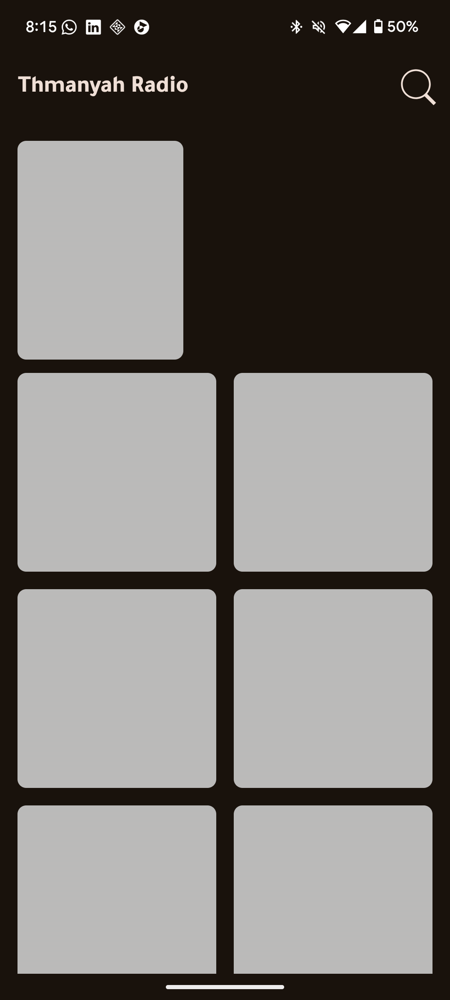
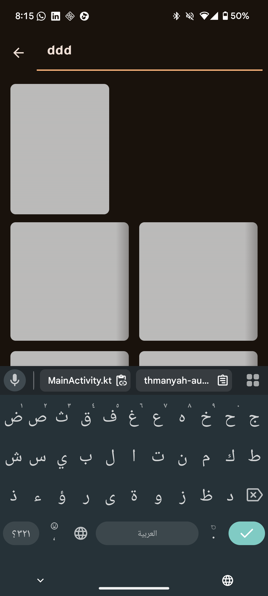
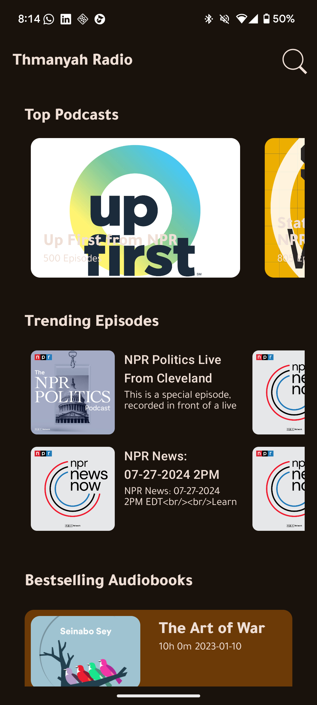

# 🎧 Thmanyah Audio Task

A sample audio content app built using modern Android development tools and architecture. This app fetches sections of audio content such as podcasts and displays them in different layouts, supports search, skeleton loading, and a responsive UI.

## 🧰 Tech Stack

- **Jetpack Compose** - Modern UI Toolkit
- **MVVM Architecture** - For separation of concerns
- **Koin** - Dependency Injection
- **Retrofit Client** - Networking
- **Kotlin Coroutines + Flow** - Asynchronous and reactive programming
- **Material 3** - Design components
- **Navigation Compose** - Screen navigation
- **Coil** - Image loading
- **Compose Shimmer** - Custom shimmer loading UI
- **JUnit + MockK/Mockito** - Unit testing

## 🧱 Features

- 🎨 Custom dark/light theme based on Thmanyah brand colors
- 🧠 MVVM with clean separation of UI, presentation, and data layers
- 🔍 Search functionality with debounce
- 🦴 Shimmer skeleton loading
- 🧭 Compose Navigation between screens
- 📦 Modular and testable codebase
- 🧪 Unit tests for repository and ViewModel
- 🌀 Pull to refresh (Compose version)

## 📁 Project Structure

thmanyah-audio-task/
├── data/ # Network & DTOs
├── domain/ # Use cases
├── repository/ # Interfaces + implementations
├── ui/
│ ├── home/ # Home screen views, ViewModel, UI models
│ ├── search/ # Search screen views, ViewModel
│ └── theme/ # Custom colors, typography, spacing
├── utils/ # Mappers, helpers
└── MainActivity.kt # App entry point

## 🚀 Getting Started

### Prerequisites

- Android Studio Hedgehog or newer
- Kotlin 1.9+
- Gradle 8.0+
- Android SDK 33+

### Run the app

1. Clone the repo:
    git clone https://github.com/Fathsaif/Thmanyah-Audio-Task.git
2. Open in Android Studio
3. Click `Run` ▶️

## 🧪 Running Unit Tests

To run tests:

./gradlew testDebugUnitTest

🖼️ Screenshots and demo 

Demo Link :
https://drive.google.com/file/d/1sXN36vZZOrBQ8gj7QN9B3CfkgcZ-pJUa/view?usp=sharing

💡 Future Improvements
Integrate pagination

Use MVI for better state management

Add support for offline caching

Made with ❤️ for Thmanyah
